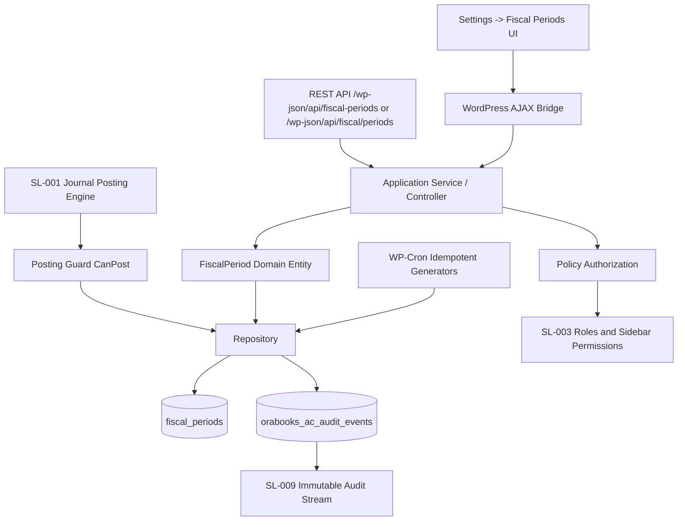
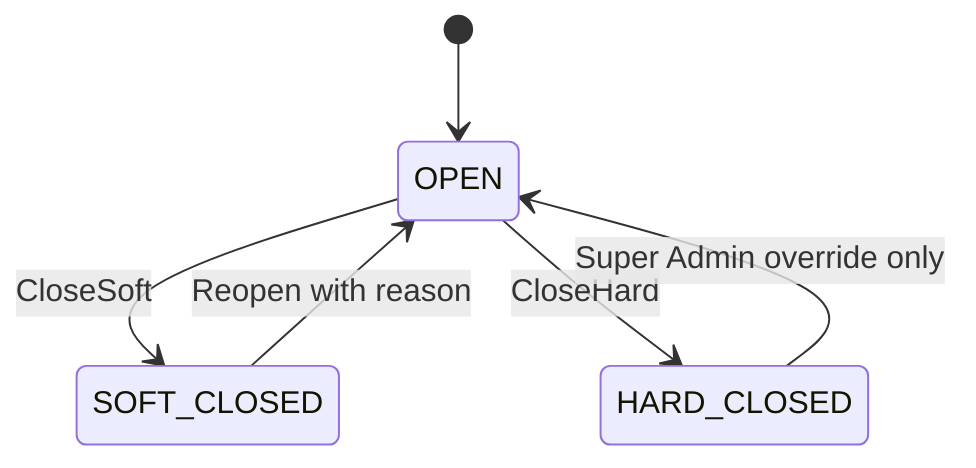

# SL-304 Fiscal Period & Lock Governance

## Architecture Diagram



## Clean Architecture Mapping

- Domain: `OBN_Fiscal_Period` and `OBN_Fiscal_Period_Status` encapsulate state, posting, reversal, and transition rules.
- Application: `OBN_Fiscal_Periods` exposes commands and queries through REST and AJAX handlers.
- Infrastructure: `OBN_Fiscal_Period_Repository` owns WordPress `$wpdb`, schema installation, tenant-scoped queries, transactions, audit appends, and idempotent creation.
- Presentation/API: `templates/settings/fiscal-periods.php` and WordPress REST routes are thin surfaces over application commands.
- Policy: `OBN_Fiscal_Period_Policy` maps SL-003 role/menu access to view, close, reopen, and Super Admin override decisions.

## Database Schema

Table: `{prefix}fiscal_periods`

- `id` bigint unsigned primary key
- `org_id` bigint unsigned, scoped to `get_current_blog_id()`
- `period_type` varchar: `MONTH`, `QUARTER`, `FISCAL_YEAR`
- `period_name` varchar
- `period_start` date
- `period_end` date
- `status` varchar: `OPEN`, `SOFT_CLOSED`, `HARD_CLOSED`
- `closed_by`, `closed_at`
- `reopened_by`, `reopened_at`, `reopen_reason`
- `created_at`, `updated_at`

Indexes:

- `org_id`
- `(org_id, status)`
- `(org_id, period_start)`
- `(org_id, period_end)`
- unique `(org_id, period_type, period_start)`

Overlap is rejected per organization and period type, so Month, Quarter, and Fiscal Year calendars can coexist while duplicate/overlapping periods of the same type are blocked:

```sql
WHERE org_id = :org_id
  AND period_type = :period_type
  AND period_start <= :new_end
  AND period_end >= :new_start
```

## State Machine



Illegal transitions return `WP_Error` validation errors and never update the database.

## Posting Integration

`OBN_Journal_Entries::add_entry()` calls `OBN_Fiscal_Period_Posting_Guard::can_post($orgId, $entryDate)` before inserting journal rows.

- `OPEN`: posting allowed.
- `SOFT_CLOSED`: returns HTTP-style conflict error, "Fiscal period is closed. Cannot post."
- `HARD_CLOSED`: returns HTTP-style conflict error, "Fiscal period is locked. Cannot post."

## Audit Events

Audit rows are append-only in `{prefix}orabooks_ac_audit_events`.

Events:

- `period_closed`
- `period_hard_closed`
- `period_reopened`
- `period_override_reopened`

Captured fields include user, timestamp, old status, new status, reason or justification, entity ID, and organization ID.
