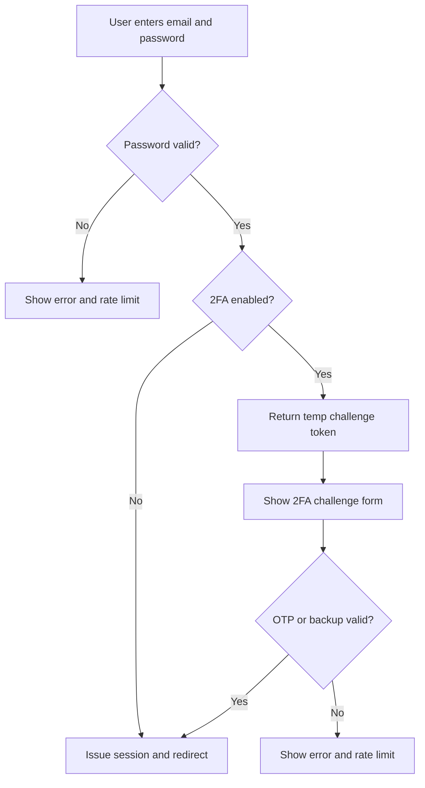
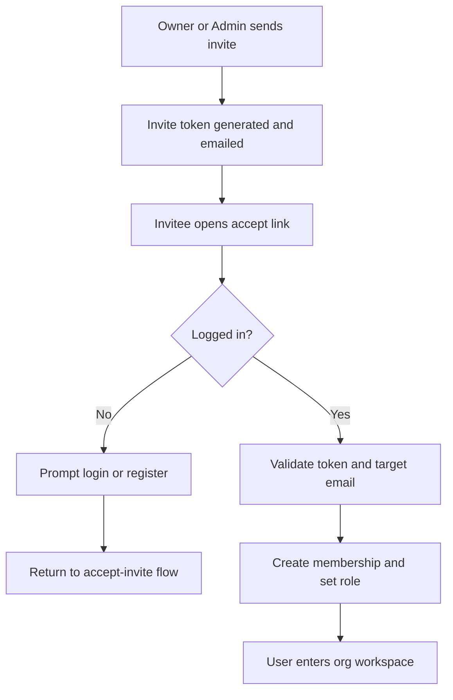
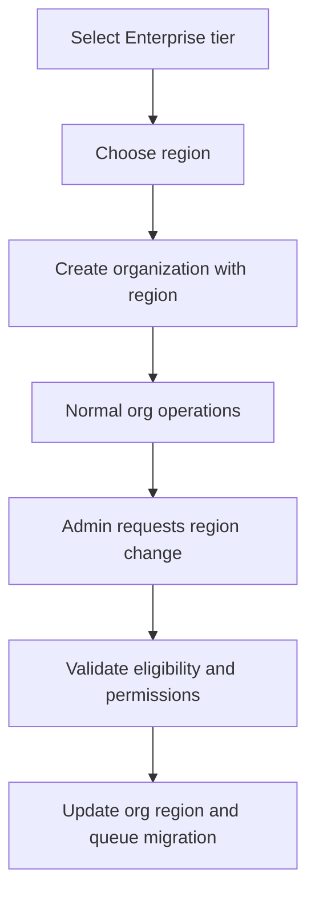

# OraBooks User Guide: Secret/TLS, 2FA, Organizations/Users/Teams, and Multi-tenant Residency

## Document Purpose

This guide explains:

1. What each feature does for users and admins.
2. How to use it from the interface.
3. How it works internally (high-level process).
4. Common issues and what to check first.

Target audience:

- Platform Admin
- Organization Owner/Admin
- Team Members

---

## 1) Secret and TLS Security

### 1.1 What this section means

In OraBooks, sensitive values like JWT signing keys and encryption keys are treated as secrets.
TLS means HTTPS transport security, so data moving between browser and server is encrypted.

In normal user screens, you usually do not type these secrets manually. Instead, you monitor security health and deploy checks from admin pages.

### 1.2 Where you see this in interface

Primary places:

- Admin Dashboard: shows deploy verification warnings.
- Admin Settings: post-deploy verification actions.
- Admin Security Dashboard: shows header status, scan status, and secret-rotation due state.

### 1.3 Interface workflow (Admin)

#### A) Check secret/TLS health

1. Open Admin Dashboard.
2. Look for deploy verification warning.
3. If warning exists, open Platform Settings and scroll to post-deploy verification.
4. Run Deploy Checks.
5. Review rows like JWT secret, encryption key, HTTPS requirement, TLS certificate status.

#### B) Repair common post-deploy issues

1. Click Repair (when available in Platform Settings).
2. System re-schedules missing cron jobs.
3. Re-run Deploy Checks to confirm all required checks are green.

#### C) Monitor continuous security state

1. Open Security Dashboard.
2. Review:
   - Security headers status
   - Scheduled scan results
   - Secret rotation status (days since last rotation, due/overdue)
3. Click Verify Controls for latest OWASP control verification status.

### 1.4 How it works (process)

1. OraBooks evaluates runtime security status (secrets and TLS state).
2. Deploy checks aggregate pass/fail items.
3. If HTTPS is required in production and request is HTTP, app redirects to HTTPS.
4. TLS certificate inspection checks expiry and warns/alerts when expiring or expired.
5. Security dashboard pulls security scans, header states, and rotation metadata.

### 1.5 Operational note

Secret values should come from secure providers (environment variables, secret manager, or secure file path), not from source code.
Use the secret rotation runbook for planned key rotation windows.

---

## 2) Two-Factor Authentication (2FA)

### 2.1 What this section means

2FA adds a second verification step after password login:

- Authenticator app TOTP code (preferred)
- Backup code (recovery path)

It protects user accounts even if a password is leaked.

### 2.2 Where users see this in interface

- Login page (2FA challenge appears after password if enabled)
- Security 2FA page

Common routes:

- /login
- /security/2fa

### 2.3 User workflow: enable 2FA

1. Log in normally.
2. Open Security > Two-Factor Authentication.
3. Click Enable 2FA.
4. Scan QR with authenticator app or copy manual setup key.
5. Enter 6-digit OTP from app.
6. Click Verify and enable.
7. Save backup codes securely.

Expected result:

- 2FA enabled status becomes active.
- Remaining backup code count is shown.

### 2.4 User workflow: login with 2FA

1. Enter email + password on login page.
2. If 2FA enabled, login form switches to 2FA challenge form.
3. Enter either:
   - 6-digit authenticator OTP, or
   - Backup code
4. Submit and continue to dashboard/workspace.

### 2.5 User workflow: backup codes

#### View unused backup codes

1. Open Security 2FA page.
2. In View backup codes panel, enter current OTP.
3. Click Show backup codes.

#### Regenerate backup codes

1. Open Security 2FA page.
2. In Regenerate backup codes panel, enter current OTP.
3. Click Generate new codes.
4. Old backup codes are invalidated.

### 2.6 User workflow: disable 2FA

1. Open Security 2FA page.
2. Enter current OTP in Disable 2FA section.
3. Click Disable 2FA.

Important:

- If organization policy requires mandatory 2FA, disable is blocked.

### 2.7 Admin workflow: recover/reset user 2FA

1. Open Admin Users.
2. Find user with 2FA enabled.
3. Click Reset 2FA.
4. Enter justification.
5. Submit.

Expected result:

- 2FA is cleared for that user.
- Audit event is recorded.
- User must re-setup 2FA on next use.

### 2.8 How it works (process)

1. Password login succeeds.
2. If user has 2FA enabled, backend returns temporary challenge token (short expiry).
3. Frontend displays challenge form.
4. Backend verifies OTP or verifies backup code hash.
5. On success, normal session token + refresh token are issued.
6. Failed attempts are rate-limited and audit-logged.

---

## 3) Organizations, Users, and Teams

### 3.1 What this section means

This section governs:

- Organization lifecycle (active/suspended/etc.)
- User account status and 2FA posture
- Team member invitations and role-based access

### 3.2 Admin interface workflow: Organizations

1. Open Admin Organizations.
2. Filter by:
   - Type (customer/partner)
   - Status (active, pending_setup, suspended, etc.)
3. Review each org row:
   - Subdomain
   - Tier
   - Region
   - Status
4. Use actions:
   - Suspend (active org)
   - Activate (eligible customer org)
   - Region change (enterprise customer only)

### 3.3 Admin interface workflow: Users

1. Open Admin Users.
2. Review:
   - Verified email status
n   - 2FA status
   - Org ID
3. If needed, run 2FA recovery with justification.

### 3.4 Team interface workflow (inside org workspace)

Open Team page.

#### Invite member

1. Enter email.
2. Select role (admin/approver/staff/viewer).
3. Click Send Invite.

#### Manage members

- Change role from role dropdown (if your permissions allow).
- Remove user (if your permissions allow).

#### Manage invitations

- Resend invitation.
- Cancel invitation.

### 3.5 Invite acceptance flow

1. Invited user opens Accept Invite link.
2. If not logged in, user is prompted to log in or register.
3. After authentication, invitation is accepted and org membership is applied.
4. User enters workspace with role-based access.

### 3.6 How permissions are enforced

1. Team page gets dashboard payload from backend.
2. Backend computes effective permissions from role.
3. Frontend only shows actions allowed by those capabilities.
4. Backend re-checks permission on each action endpoint.

So even if a button is hidden in UI, server checks still enforce security.

---

## 4) Multi-tenant Residency

### 4.1 What this section means

Multi-tenant means many organizations run on shared platform while each org stays isolated.
Residency means where org data is designated (region choice).

### 4.2 Where users choose residency

During tier selection:

1. User selects plan (free/premium/enterprise).
2. If enterprise selected, Data residency region selector appears.
3. User must choose region before continuing.

### 4.3 Tier setup workflow

1. Open Tier Selection page.
2. Pick tier.
3. Choose subdomain.
4. Click Check availability.
5. Confirm permanent subdomain checkbox.
6. If enterprise, choose region.
7. Click Continue.

Expected result:

- Organization is created with tier, subdomain, and validated region.

### 4.4 Admin workflow: region change

Available only for eligible orgs:

- organization_type = customer
- tier = enterprise
- status not fraud_freeze

Steps:

1. Open Admin Organizations.
2. On eligible row, choose new region from dropdown.
3. Confirm change.
4. Backend records change and queues migration workflow/event.

### 4.5 Tenant isolation model (how it works)

Isolation is enforced by org-scoped checks:

1. User session carries org context.
2. Each protected action validates user role + org scope.
3. Cross-tenant target org operations are denied.
4. Partner organizations are blocked from accounting-only actions.
5. Subdomain and org mapping are validated at auth and routing points.

### 4.6 What users experience when blocked

Typical outcomes:

- Permission denied (role too limited)
- Organization not active
- Cross-tenant action rejected
- Partner accounting access denied

---

## 5) End-to-end process maps

### 5.1 Login with 2FA

### 5.2 Team invite flow

### 5.3 Enterprise region lifecycle

---

## 6) Troubleshooting quick reference

### Secret/TLS

- Deploy check says HTTPS required:
  - Ensure site is served via HTTPS and production TLS config is active.
- TLS cert expiring/expired:
  - Renew certificate, then re-run deploy checks.
- Secret rotation overdue:
  - Follow runbook and rotate in maintenance window.

### 2FA

- Invalid OTP:
  - Confirm phone time sync and retry current code.
- Backup code rejected:
  - Ensure code is unused and correctly typed.
- Cannot disable 2FA:
  - Org likely enforces mandatory 2FA.

### Organizations/Teams

- Invite accepted but no access:
  - Confirm user accepted with invited email and membership exists.
- Role change not visible:
  - User may need re-login for refreshed token permissions.

### Residency

- Cannot change region:
  - Org must be enterprise customer and not fraud frozen.

---

## 7) Recommended operating practices

1. Make 2FA mandatory for all production organizations.
2. Keep backup codes in secure password vaults.
3. Review Admin Security dashboard weekly.
4. Run deploy checks after every release.
5. Keep secret rotation on a fixed schedule.
6. Restrict owner/admin roles and review role assignments monthly.

---

## 8) Related internal references

- SL-008 secret rotation runbook
- OWASP security dashboard controls
- Team invitation and RBAC workflows
- Organization and residency governance

End of guide.
